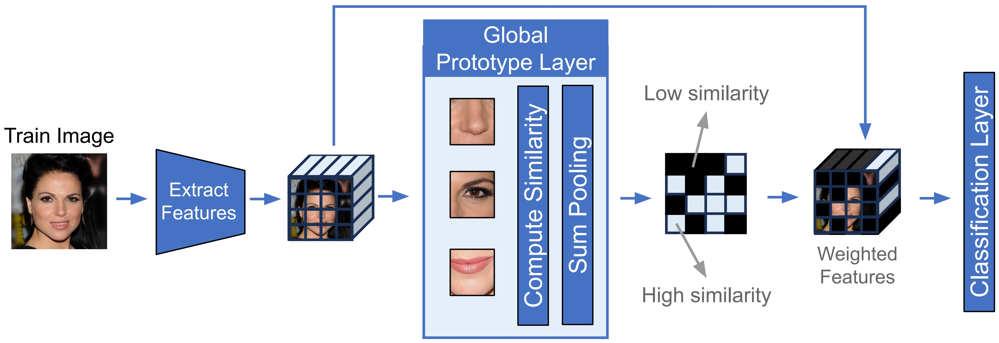
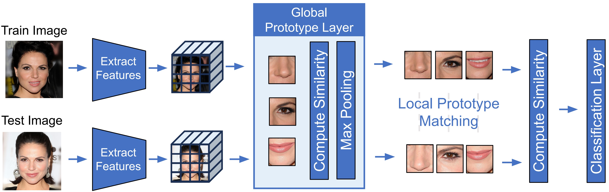

# ProtoSiamese

This repository contains the code for ProtoSiamese, a prototype-based Siamese network for few-shot learning.

The code is based on the implementation of the paper ProtoPNet, with modifications to adapt it for Siamese networks.

The architecture is designed to learn a small set of abstract/semantic prototypes and use them to create multiple semantic comparisons for verification tasks.

## Architecture

The architecture consists of two development and training step presented in the following images:

